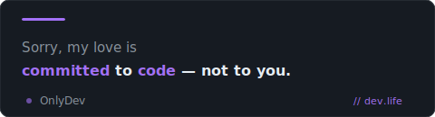

  

## 📌 About Me

- 🚀 Full-Stack Web Developer passionate about building modern, scalable, and user-friendly web applications.
- 💻 Experienced with React, JavaScript, Spring Boot, REST APIs, and database design.
- 🌱 Continuously learning new technologies and striving to create impactful digital solutions.

## 🧠 My Focus Areas

- 🌐 Web Development
- ✨ UX/UI Design

## 🎯 Current Goals

- 🇰🇷 Become a Bridge Software Engineer (BrSE)
- ⚛️ Build scalable React applications
- ☁️ Learn AWS deployment and architecture
- 🤖 Integrate AI into real-world products and workflows
- 📚 Strengthen software design and system thinking
- 🚀 Develop high-performance full-stack applications with smooth frontend-backend integration

## 📊 GitHub Stats & Trophies

  

  

  

## 🛠️ Languages & Tools

<h3 align="center">Programming Languages</h3>

  &nbsp;
  &nbsp;
  &nbsp;
  &nbsp;
  &nbsp;
  &nbsp;

<h3 align="center">Frontend</h3>

  &nbsp;
  &nbsp;
 &nbsp;
  &nbsp;
  &nbsp;
&nbsp;

<h3 align="center">Backend</h3>

  &nbsp;
  &nbsp;

       &nbsp;
  &nbsp;

<h3 align="center">Database</h3>

  &nbsp;
  &nbsp;

<h3 align="center">DevOps & Cloud</h3>

  &nbsp;
  &nbsp;
  &nbsp;

<h3 align="center">Tools</h3>

  &nbsp;
  &nbsp;
  &nbsp;
  &nbsp;
  &nbsp;

  

  

 

## 🔗 Connect with Me

  &nbsp;&nbsp;
  

  

  

  

